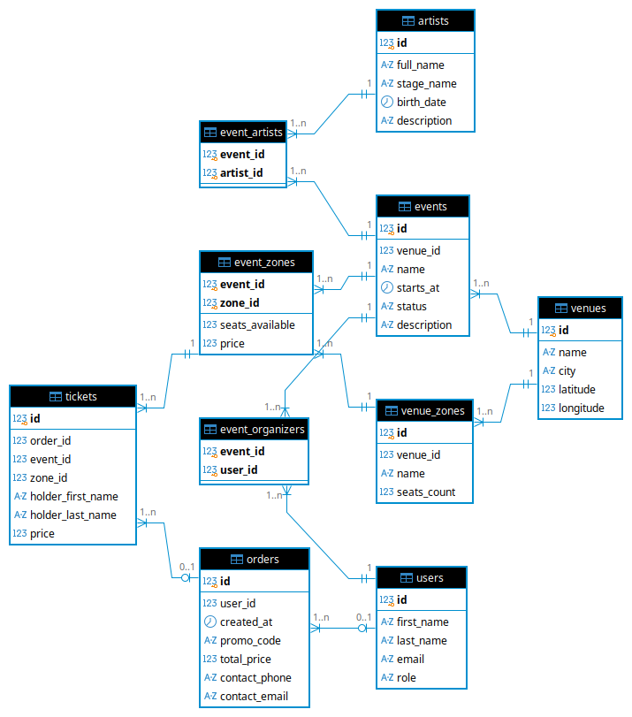

# ЛР 1. Проектирование и реализация реляционной базы данных

**Вариант 12 — сервис продажи билетов на мероприятия.** Срок: 20 октября.

## Задание

По выданному варианту предметной области необходимо:

1. Выделить основные сущности, их атрибуты и связи.
2. Спроектировать реляционную модель данных, приведённую к 3НФ.
3. Построить ER-диаграмму с указанием таблиц и основных атрибутов, первичных и внешних ключей, связей.
4. Реализовать спроектированную БД в PostgreSQL.
5. Заполнить БД тестовыми данными.
6. Продемонстрировать работу ограничений целостности.

**Требования к базе данных:**

- не менее 5 содержательных таблиц;
- не менее 2 ограничений `UNIQUE`;
- не менее 3 ограничений `CHECK`;
- не менее одного составного ограничения;
- `NOT NULL` для обязательных атрибутов.

Типы данных, ключи и правила `ON DELETE` выбираются в соответствии с предметной областью.

**Тестовые данные** должны позволять проверить все связи и ограничения. Нужно подготовить минимум 5 некорректных операций `INSERT`/`UPDATE`, которые PostgreSQL отклоняет из-за ограничений целостности.

**Изменение требований** (сдаётся отдельно): после реализации преподаватель выдаёт изменение предметной области. Структуру нужно изменить через DDL (`ALTER TABLE` и т. п.) без пересоздания БД и с сохранением данных.

## Файлы

| Файл                                            | Содержание                                                                                                                       |
| --------------------------------------------------- | ------------------------------------------------------------------------------------------------------------------------------------------ |
| [schema.sql](schema.sql)                             | создание структуры БД: 10 таблиц, ключи, ограничения                                              |
| [data.sql](data.sql)                                 | тестовые данные                                                                                                              |
| [constraints_test.sql](constraints_test.sql)         | 18 операций, которые база отклоняет, и демонстрация`ON DELETE`                                  |
| [er-diagram-crowsfoot.png](er-diagram-crowsfoot.png) | ER-диаграмма, нотация Crow's Foot                                                                                          |
| [er-diagram-idef1x.png](er-diagram-idef1x.png)       | ER-диаграмма, нотация IDEF1X                                                                                               |
| `migration.sql`                                   | изменение структуры по дополнительному требованию (будет выдано на защите) |

## ER-диаграмма



## Запуск

Из корня репозитория:

```bash
docker compose up -d
docker compose exec db psql -U student -d labs -f /labs/lab1/schema.sql
docker compose exec db psql -U student -d labs -f /labs/lab1/data.sql
docker compose exec db psql -U student -d labs -f /labs/lab1/constraints_test.sql
```

`schema.sql` и `data.sql` можно запускать повторно: первый пересоздаёт таблицы, второй очищает их и сбрасывает счётчики id.
